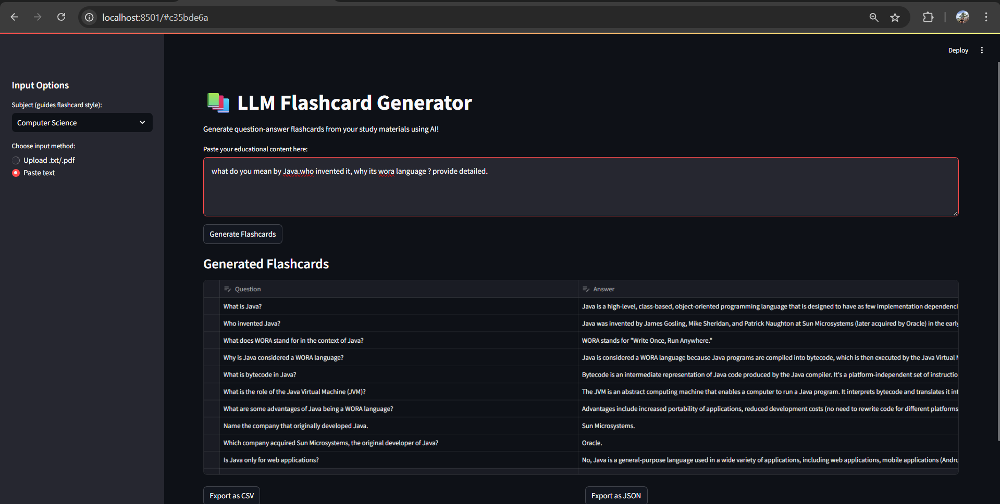

# 📚 LLM Flashcard Generator

**Generate high-quality question-answer flashcards from your study materials using the power of Large Language Models (LLMs).**

---

## 🌟 Overview

LLM Flashcard Generator is a modern Streamlit web app that transforms any educational content—be it textbook excerpts, lecture notes, or even a single word—into effective, editable flashcards. Powered by Google Gemini, it is designed for students, educators, and lifelong learners who want to supercharge their revision and teaching.

---

## 💡 Motivation

Traditional flashcard creation is time-consuming and repetitive. With the rise of LLMs, we can automate this process, ensuring high-quality, diverse, and context-aware Q&A pairs for any subject or topic—instantly.

---

## 🚀 Features

- **Flexible Input:** Upload `.txt` files or paste any text
- **Subject Selection:** Guide flashcard style by subject (Biology, History, etc.)
- **LLM-Powered:** Uses Google Gemini for accurate, context-rich flashcards
- **Robust:** Works even with a single word as input
- **Review & Edit:** Interactive table for editing and refining flashcards
- **Export:** Download as CSV or JSON for use in Anki, Quizlet, etc.
- **Modern UI:** Clean, responsive Streamlit interface
- **No-code:** Runs locally in your browser

---

## 🛠️ Tech Stack

- **Frontend/UI:** [Streamlit](https://streamlit.io/)
- **Backend/LLM:** [Google Gemini API](https://ai.google.dev/)
- **Helpers:** Python, pandas, dotenv

---

## 🏗️ Architecture

```mermaid
flowchart TD
    A[User Uploads Text or File] --> B[Streamlit UI]
    B --> C[Text Extraction & Preprocessing]
    C --> D[Gemini LLM API]
    D --> E[Parse Q&A Flashcards]
    E --> F[Review/Edit Table]
    F --> G[Export (CSV/JSON)]
```

---

## 📁 File Structure

```
LLM/
├── app.py                  # Main Streamlit app
├── gemini_utils.py         # LLM API integration (Gemini)
├── requirements.txt        # Python dependencies
├── .env                    # Environment variables (your API key)
├── README.md               # This file
├── streamlit_debug.py      # (Optional) Debugging helpers
├── test_gemini_flashcards.py # (Optional) Test script for Gemini API
```

---

## ⚡ Quick Start

1. **Clone the repository:**

    ```bash
    git clone https://github.com/yourusername/your-repo.git
    cd your-repo
    ```

2. **Install dependencies:**

    ```bash
    pip install -r requirements.txt
    ```

3. **Set up your API key:**

    Create a file named `.env` in the project root:
    ```env
    GEMINI_API_KEY=YOUR_GEMINI_API_KEY
    ```
    *(Get your Gemini API key from [Google AI Studio](https://ai.google.dev/))*

4. **Run the app locally:**

    ```bash
    streamlit run app.py
    ```
    The app will open in your browser at [http://localhost:8501](http://localhost:8501)

---

## 🖥️ Running the Project via GitHub, Git Bash, and CLI

This project is designed to be run from any terminal environment, including **Git Bash**, **Windows Command Prompt**, **PowerShell**, **Mac Terminal**, and **Linux shell**. Follow these professional, step-by-step instructions to ensure a smooth setup and launch:

### 1. Clone the Repository
Clone the repository from GitHub using your preferred terminal:
```bash
git clone https://github.com/yourusername/your-repo.git
cd your-repo
```

### 2. Install Python Dependencies
Install all required Python packages:
```bash
pip install -r requirements.txt
```
- If you have multiple Python versions, use:
  ```bash
  python -m pip install -r requirements.txt
  ```
- If you encounter permission errors, try:
  ```bash
  pip install --user -r requirements.txt
  ```

### 3. Configure Your API Key
Create a `.env` file in the project root directory and add your Gemini API key:
```env
GEMINI_API_KEY=YOUR_GEMINI_API_KEY
```
- Replace `YOUR_GEMINI_API_KEY` with your actual key from [Google AI Studio](https://ai.google.dev/).

### 4. Launch the Application
Start the Streamlit app using one of the following commands:
```bash
streamlit run app.py
```
- If `streamlit` is not recognized, use:
  ```bash
  python -m streamlit run app.py
  ```

After running the command, open your browser and navigate to [http://localhost:8501](http://localhost:8501) to use the app.

### 5. Notes for Windows, Mac, and Linux Users
- All commands above work in **Git Bash**, **Command Prompt**, **PowerShell**, **Mac Terminal**, and **Linux shell**.
- If you see a `ModuleNotFoundError`, ensure you are installing packages for the same Python interpreter that runs Streamlit.
- For advanced troubleshooting, consult the [Streamlit documentation](https://docs.streamlit.io/) or your terminal’s help resources.

---


## 🌐 Deployment

### Deploy via Command Line

Make sure your `.env` and `requirements.txt` are present, then run:

```bash
streamlit run app.py
```

### Deploy on GitHub

1. **Create a new GitHub repo:**
    - Go to [github.com/new](https://github.com/new)
2. **Push your code:**
    ```bash
    git init
    git remote add origin https://github.com/yourusername/your-repo.git
    git add .
    git commit -m "Initial commit"
    git push -u origin main
    ```
3. **(Optional) Deploy on Streamlit Cloud:**
    - Go to [streamlit.io/cloud](https://streamlit.io/cloud)
    - Connect your GitHub repo and follow their deployment steps
    - Add your `GEMINI_API_KEY` in the Streamlit Cloud secrets manager

---

## 📝 Sample Output



---

## 🧑‍💻 Usage Guide

- Upload your educational material or paste text
- Select a subject (optional, but improves results)
- Click **Generate Flashcards**
- Review and edit the generated flashcards
- Export as CSV or JSON

---

## ❓ FAQ

**Q: What file types are supported?**
A: You can upload `.txt` 'docx' files or paste any text. 

**Q: Is my data private?**
A: Yes, all processing happens locally—your data is never stored or shared.

**Q: Can I use my own LLM or API key?**
A: Yes! Just set your API key in the `.env` file.

**Q: Can I deploy this on the web?**
A: Absolutely! Use Streamlit Cloud for one-click deployment.

---
Thank you for using LLM Flashcard Generator! If you have any questions or need support, please open an issue or email [urjagjeetsingh@gmail.com](mailto:urjagjeetsingh@gmail.com).
