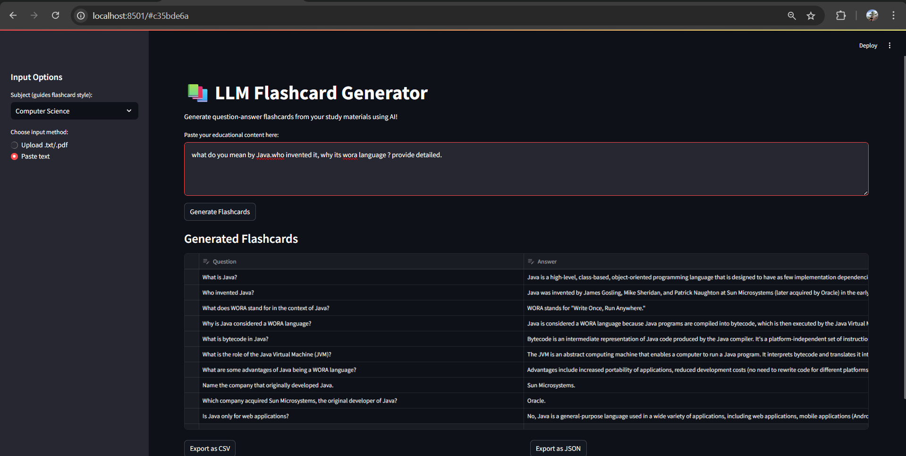

# 📚 LLM Flashcard Generator


**Generate high-quality question-answer flashcards from your study materials using the power of Large Language Models (LLMs) and Structured JSON Outputs.**

---

## 🌟 Overview

LLM Flashcard Generator is a production-grade Streamlit web app that transforms any educational content—be it textbook excerpts, lecture notes, or even a single word—into effective, editable flashcards. Powered by **Google Gemini 2.0 Flash** and **Pydantic** for rigorous data validation, it guarantees perfectly formatted flashcards every time.

Designed for students, educators, and lifelong learners who want to supercharge their revision and teaching.

---

## 💡 Motivation

Traditional flashcard creation is time-consuming and repetitive. With the rise of LLMs, we can automate this process. This application utilizes modern LLM techniques like **Structured Outputs** to ensure high-quality, diverse, and context-aware Q&A pairs that are always parsable and formatted perfectly.

---

## 🚀 Features

- **Flexible Input:** Upload `.pdf`, `.docx`, `.txt` files or paste any text directly.
- **Subject Selection:** Guide flashcard style by subject (Biology, History, etc.).
- **Structured LLM Outputs:** Uses the official `google-genai` SDK and Pydantic schema validation to guarantee 100% accurate JSON responses. No brittle string parsing.
- **Robust:** Works even with a single word as input, generating creative context.
- **Review & Edit:** Interactive, dynamic data table for editing and refining flashcards.
- **Export:** Download as CSV or JSON for seamless import into Anki, Quizlet, etc.
- **Containerized:** Fully Dockerized for instant, consistent deployment anywhere.

---

## 🛠️ Tech Stack & Architecture

- **Frontend/UI:** [Streamlit](https://streamlit.io/)
- **Backend/LLM:** [Google GenAI SDK](https://github.com/googleapis/python-genai)
- **Data Validation:** [Pydantic](https://docs.pydantic.dev/)
- **Document Parsing:** PyPDF2, python-docx
- **Deployment:** Docker

---

## 📁 File Structure

```
Phoenix/
├── Dockerfile                  # Containerization config
├── requirements.txt            # Python dependencies
├── .env                        # Environment variables (your API key)
├── README.md                   # This file
├── src/
│   ├── app.py                  # Main Streamlit UI entrypoint
│   ├── models/
│   │   └── flashcard.py        # Pydantic schemas for data validation
│   ├── services/
│   │   └── llm_service.py      # Google GenAI API integration
│   └── utils/
│       └── document_parser.py  # PDF, DOCX, TXT extraction logic
└── tests/                      # Unit testing directory
```

---

## ⚡ Quick Start (Local Setup)

1. **Clone the repository:**
    ```bash
    git clone https://github.com/techwallahexplorer/Phoenix.git
    cd Phoenix
    ```

2. **Install dependencies:**
    ```bash
    pip install -r requirements.txt
    ```

3. **Set up your API key:**
    Create a file named `.env` in the project root:
    ```env
    GEMINI_API_KEY=YOUR_GEMINI_API_KEY
    ```
    *(Get your Gemini API key from [Google AI Studio](https://ai.google.dev/))*

4. **Run the app locally:**
    ```bash
    streamlit run src/app.py
    ```
    The app will open in your browser at [http://localhost:8501](http://localhost:8501)

---

## 🐳 Quick Start (Docker)

For the most reliable experience without managing Python environments, run the app using Docker.

1. **Build the image:**
    ```bash
    docker build -t llm-flashcards .
    ```

2. **Run the container:**
    ```bash
    docker run -p 8501:8501 -e GEMINI_API_KEY=your_api_key_here llm-flashcards
    ```

3. Access the app at `http://localhost:8501`.

---

## 🌐 Deployment to Streamlit Cloud

1. **Fork/Clone** this repository to your GitHub account.
2. Go to [streamlit.io/cloud](https://streamlit.io/cloud) and connect your GitHub repo.
3. Set the Main file path to `src/app.py`.
4. In the Streamlit Cloud advanced settings, add your `GEMINI_API_KEY` to the **Secrets** manager.
5. Click **Deploy**.

---

## 📝 Sample Output



*(Note: The UI includes dynamic data tables, expandable preview cards, and one-click JSON/CSV exports.)*

---

## ❓ FAQ

**Q: What file types are supported?**  
A: You can upload `.pdf`, `.docx`, `.txt` files or paste any raw text. 

**Q: Why use Pydantic and Structured Outputs?**  
A: Earlier versions relied on regex and string matching to parse LLM text (e.g., looking for "Q:" and "A:"). By using Pydantic with the Google GenAI SDK's `response_schema`, the LLM is forced to return valid JSON. This eliminates parsing errors and hallucinations.

**Q: Is my data private?**  
A: If running locally via Docker or Python, all processing stays on your machine (sent directly to the Google API).

---

## 🤝 Contributing

For major changes, please open an issue first to discuss what you would like to change. Pull requests implementing direct Anki (`.apkg`) export or RAG for massive textbooks are welcome!

---

## 📫 Contact
Thank you for using LLM Flashcard Generator! If you have any questions or need support, please open an issue or email [urjagjeetsingh@gmail.com](mailto:urjagjeetsingh@gmail.com).
